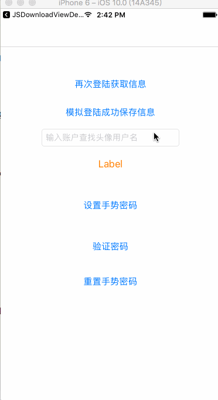

# Gestures-password-Swift

<html>
<body>
<h2>什么是 Gestures-password-Swift</h2>

这是一个基于swift3.0语言实现的手势解锁封装

<h2>效果图展示</h2>

<h2>使用方法</h2>
<h3>设置新密码的时候</h3>

let passwordLock = NSUserDefaults.standardUserDefaults().objectForKey("passwordLock") 
        if let pass = passwordLock { 
            let alertView = UIAlertView.init(title: "提示", message: "您已经设置了手势密码", delegate: nil, cancelButtonTitle: "确定") 
            alertView.show() 
        }else{ 
            let lockView = LockViewController() 
            self.presentViewController(lockView, animated: true, completion: nil) 
        } 

        
        
<h3>重置密码或者验证密码的时候</h3>
</body>

let passwordLock = NSUserDefaults.standardUserDefaults().objectForKey("passwordLock") 
        if let pass = passwordLock { 
            let lockView = LockViewController() 
            //下面这个参数是用来说明是重置密码还是验证密码 
//            lockView.resetIs = "resetIs" 
            lockView.reset = "请输入原密码" 
            self.presentViewController(lockView, animated: true, completion: nil) 
        }else{ 
            
            let alertView = UIAlertView.init(title: "提示", message: "您尚未设置手势密码", delegate: nil, cancelButtonTitle: "确定") 
            alertView.show() 
        } 

</html>